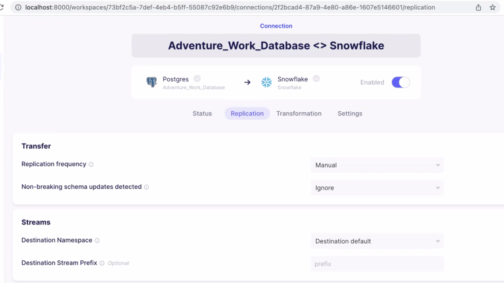

# Adventure Works ETL Pipeline using AWS, Airbyte, Snowflake and Dbt

Find effectiveness of each sales person based on different parameters to provide meaningful insights to boost sales.

## Setup Steps
1. Create an RDS Postgres DB to host the Adventure Works DB: https://github.com/Data-Engineer-Camp/2023-01-bootcamp/tree/main/09-project-2/adventure_works
2. Set up Airbyte-specific entities in Snowflake
    ```sql
    -- set variables (these need to be uppercase)
    set airbyte_role = 'AIRBYTE_ROLE';
    set airbyte_username = 'AIRBYTE_USER';
    set airbyte_warehouse = 'AIRBYTE_WAREHOUSE';
    set airbyte_database = 'AIRBYTE_DATABASE';
    set airbyte_schema = 'AIRBYTE_SCHEMA';

    -- set user password
    set airbyte_password = 'password';

    begin;

    -- create Airbyte role
    use role securityadmin;
    create role if not exists identifier($airbyte_role);
    grant role identifier($airbyte_role) to role SYSADMIN;

    -- create Airbyte user
    create user if not exists identifier($airbyte_username)
    password = $airbyte_password
    default_role = $airbyte_role
    default_warehouse = $airbyte_warehouse;

    grant role identifier($airbyte_role) to user identifier($airbyte_username);

    -- change role to sysadmin for warehouse / database steps
    use role sysadmin;

    -- create Airbyte warehouse
    create warehouse if not exists identifier($airbyte_warehouse)
    warehouse_size = xsmall
    warehouse_type = standard
    auto_suspend = 60
    auto_resume = true
    initially_suspended = true;

    -- create Airbyte database
    create database if not exists identifier($airbyte_database);

    -- grant Airbyte warehouse access
    grant USAGE
    on warehouse identifier($airbyte_warehouse)
    to role identifier($airbyte_role);

    -- grant Airbyte database access
    grant OWNERSHIP
    on database identifier($airbyte_database)
    to role identifier($airbyte_role);

    commit;

    begin;

    USE DATABASE identifier($airbyte_database);

    -- create schema for Airbyte data
    CREATE SCHEMA IF NOT EXISTS identifier($airbyte_schema);

    commit;

    begin;

    -- grant Airbyte schema access
    grant OWNERSHIP
    on schema identifier($airbyte_schema)
    to role identifier($airbyte_role);

    commit;
    ```
    Reference: https://docs.airbyte.com/integrations/destinations/snowflake/

3. Setup Source and Destination connections in Airbyte
    
    

    We are using Deduped + History mode on SalesOrderHeader table to handle changes in source.

4. Create an Airbyte EL Pipeline
    
    

5. Setup DBT in local system for transformation

Reference: https://docs.getdbt.com/reference/warehouse-setups/snowflake-setup